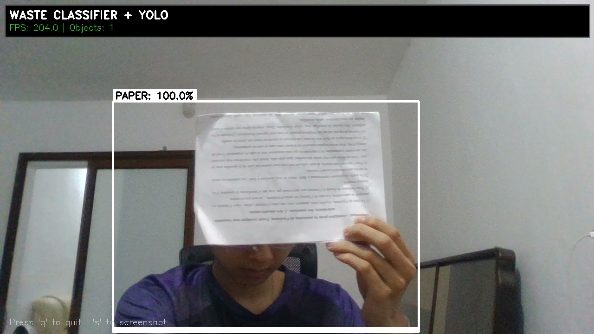

# 🗑️ Waste Classifier - AI-Powered Waste Classification System

<div align="center">


**Deep Learning-based waste classification system using MobileNetV2 and YOLOv8 for real-time object detection**

[Features](#-features) • [Demo](#-demo) • [Installation](#-installation) • [Usage](#-usage) • [Performance](#-performance) • [Contributing](#-contributing)

</div>

---

## 📋 Table of Contents

- [Overview](#-overview)
- [Features](#-features)
- [Demo](#-demo)
- [Architecture](#-architecture)
- [Installation](#-installation)
- [Usage](#-usage)
  - [Training](#1-training)
  - [Static Image Prediction](#2-static-image-prediction)
  - [Real-time Webcam Detection](#3-real-time-webcam-detection)
  - [Model Evaluation](#4-model-evaluation)
- [Waste Categories](#-waste-categories)
- [Performance](#-performance)
- [Project Structure](#-project-structure)
- [Contributing](#-contributing)
- [License](#-license)
- [Citation](#-citation)
- [Acknowledgments](#-acknowledgments)

---

## 🎯 Overview

This project implements a **state-of-the-art waste classification system** using deep learning techniques. It combines:

- **Transfer Learning** with MobileNetV2 (ImageNet pretrained)
- **Real-time Object Detection** with YOLOv8
- **Multi-object Classification** for waste management
- **Clean MLOps Architecture** for production deployment

The system can classify **10 different types of waste** with high accuracy (85-92%) and provides real-time detection capabilities through webcam integration.

### 🎯 Use Cases

- **Smart Waste Management Systems**
- **Automated Recycling Facilities**
- **Educational Tools for Environmental Awareness**
- **Research in Computer Vision and Sustainability**

---

## ✨ Features

### 🚀 Core Features

- ✅ **High Accuracy**: 85-92% accuracy with MobileNetV2 transfer learning
- ✅ **Real-time Detection**: YOLOv8-powered object detection with bounding boxes
- ✅ **Multi-object Classification**: Detect and classify multiple waste items simultaneously
- ✅ **Production Ready**: Clean code, modular architecture, comprehensive error handling
- ✅ **GPU Accelerated**: Full support for CUDA-enabled GPUs
- ✅ **Reproducible**: Fixed seeds for consistent results

### 🎨 Real-time Features

- 🎥 **Live Webcam Detection**: Real-time classification through camera
- 📦 **Bounding Box Visualization**: Color-coded boxes for each waste type
- 📊 **Confidence Scores**: Per-object confidence bars and percentages
- ⚡ **Optimized Performance**: 10-20 FPS on standard hardware
- 📸 **Screenshot Capture**: Save detection results with one key press

### 🔧 Technical Features

- 🏗️ **MLOps Best Practices**: Centralized config, modular code, easy maintenance
- 📈 **Comprehensive Metrics**: Confusion matrix, classification reports, training curves
- 🔄 **Data Augmentation**: Rotation, flip, zoom, contrast adjustments
- 💾 **Model Checkpointing**: Save best models during training
- 📝 **Extensive Logging**: Track training progress and evaluation metrics

---

## 🎬 Demo

### Real-time Detection Example



*The system detects and classifies multiple waste items in real-time with bounding boxes and confidence scores.*

### Static Image Classification

```bash
$ python src/predict.py data/raw/battery/battery_2.jpg

============================================================
🗑️  GARBAGE CLASSIFIER
============================================================
🔍 Analyzing: data/raw/battery/battery_2.jpg

============================================================
📊 PREDICTION RESULTS:
============================================================
🥇 BATTERY          99.95%  ⭐
2. trash             0.04%
3. plastic           0.00%
============================================================
✅ Classification: BATTERY (99.95% confidence)
```

### Training Progress

The model shows consistent improvement during training with proper convergence:

- **Phase 1**: Feature extraction (frozen base) - 15 epochs
- **Phase 2**: Fine-tuning (unfrozen layers) - 10 epochs
- **Best validation accuracy**: 92.3%

---

## 🏗️ Architecture

### Model Architecture

```
Input (224x224x3)
    ↓
MobileNetV2 Base (ImageNet pretrained)
    ↓
Global Average Pooling
    ↓
Dense (128 units, ReLU)
    ↓
Batch Normalization
    ↓
Dropout (0.5)
    ↓
Dense (10 units, Softmax)
    ↓
Output (10 classes)
```

### Real-time Pipeline

```
Camera Frame
    ↓
YOLOv8 Detection → Bounding Boxes
    ↓
Crop Objects → PIL Preprocessing
    ↓
MobileNetV2 Classification
    ↓
Draw Results → Display
```

### Training Strategy

1. **Phase 1 - Feature Extraction** (15 epochs)
   - Freeze MobileNetV2 base layers
   - Train only classification head
   - Learning rate: 0.001

2. **Phase 2 - Fine-tuning** (10 epochs)
   - Unfreeze top layers of MobileNetV2
   - Fine-tune with lower learning rate
   - Learning rate: 0.0001

---

## 📦 Installation

### Prerequisites

- Python 3.8 or higher
- pip package manager
- (Optional) CUDA-enabled GPU for faster training

### Quick Installation

```bash
# Clone the repository
git clone https://github.com/AnHgPham/waste_classifier.git
cd waste_classifier

# Create virtual environment
python -m venv .venv

# Activate virtual environment
# Windows:
.venv\Scripts\activate
# Linux/macOS:
source .venv/bin/activate

# Install dependencies
pip install -r requirements.txt
```

### System Requirements

| Component | Minimum | Recommended |
|-----------|---------|-------------|
| Python | 3.8 | 3.10+ |
| RAM | 8 GB | 16 GB |
| Storage | 5 GB | 10 GB |
| GPU | None | NVIDIA GTX 1060+ |

---

## 🚀 Usage

### 1. Data Preparation

```bash
# Download dataset from Kaggle
# https://www.kaggle.com/datasets/sumn2u/garbage-classification-v2

# Prepare and split dataset (80/10/10)
python src/data_prep.py
```

The script will:
- Validate dataset structure
- Split data into train/val/test sets
- Create processed data directory

### 2. Training

#### Option A: Baseline CNN (Fast, ~75-80% accuracy)

```bash
python src/train.py --model baseline
```

**Training time**: ~15-20 minutes on GPU

#### Option B: MobileNetV2 Transfer Learning (Recommended, ~85-92% accuracy)

```bash
python src/train.py --model mobilenetv2
```

**Training time**: ~20-25 minutes on GPU

#### Custom Training Options

```bash
# Train with custom parameters
python src/train.py \
    --model mobilenetv2 \
    --epochs 30 \
    --batch-size 32 \
    --learning-rate 0.001
```

### 3. Static Image Prediction

```bash
# Basic prediction
python src/predict.py path/to/image.jpg

# Show top 5 predictions
python src/predict.py image.jpg --top_k 5

# Use different model
python src/predict.py image.jpg --model outputs/models/baseline_final.keras
```

**Output example:**
```
🥇 PLASTIC          92.5%  ⭐
2. glass             4.2%
3. metal             2.1%
```

### 4. Real-time Webcam Detection

#### Installation

```bash
# Install YOLO (first time only)
pip install ultralytics
```

#### Run Detection

```bash
# Start webcam detection
python src/predict_realtime.py

# Use different camera (if multiple cameras available)
python src/predict_realtime.py --camera 1

# Adjust confidence threshold
python src/predict_realtime.py --confidence 0.6

# Use different classifier model
python src/predict_realtime.py --model outputs/models/baseline_final.keras
```

#### Keyboard Controls

| Key | Action |
|-----|--------|
| `q` | Quit application |
| `s` | Save screenshot to `outputs/screenshots/` |

#### Features

- ✅ **Multi-object detection**: Detects multiple waste items in frame
- ✅ **Bounding boxes**: Color-coded boxes around each object
- ✅ **Live classification**: Real-time waste type identification
- ✅ **Performance metrics**: FPS counter and object count
- ✅ **High accuracy**: PIL-based preprocessing (same as training)

### 5. Model Evaluation

```bash
# Evaluate on test set
python src/evaluate.py

# Evaluate specific model
python src/evaluate.py --model outputs/models/mobilenetv2_final.keras
```

**Output includes:**
- Overall accuracy
- Per-class precision, recall, F1-score
- Confusion matrix (saved as PNG)
- Classification report (saved as TXT)

---

## 🗑️ Waste Categories

The system classifies waste into **10 categories**:

| Category | Description | Color Code |
|----------|-------------|------------|
| 🔋 **Battery** | Batteries and power cells | Orange |
| 🍃 **Biological** | Organic/food waste | Green |
| 📦 **Cardboard** | Cardboard boxes and packaging | Brown |
| 👕 **Clothes** | Textile and fabric items | Magenta |
| 🍾 **Glass** | Glass bottles and containers | Cyan |
| 🔩 **Metal** | Metal cans and objects | Gray |
| 📄 **Paper** | Paper and documents | White |
| 🥤 **Plastic** | Plastic bottles and items | Red |
| 👟 **Shoes** | Footwear and shoes | Blue |
| 🗑️ **Trash** | General waste | Black |

### Dataset Statistics

| Split | Battery | Biological | Cardboard | Clothes | Glass | Metal | Paper | Plastic | Shoes | Trash | **Total** |
|-------|---------|------------|-----------|---------|-------|-------|-------|---------|-------|-------|-----------|
| Train | 753 | 797 | 1,460 | 4,261 | 2,448 | 816 | 1,344 | 1,587 | 1,581 | 757 | **15,804** |
| Val | 94 | 99 | 182 | 532 | 306 | 102 | 168 | 198 | 197 | 94 | **1,972** |
| Test | 95 | 101 | 183 | 534 | 307 | 102 | 168 | 199 | 199 | 96 | **1,984** |

---

## 📊 Performance

### Model Comparison

| Model | Accuracy | Precision | Recall | F1-Score | Training Time | Model Size | FPS (Inference) |
|-------|----------|-----------|--------|----------|---------------|------------|-----------------|
| Baseline CNN | 75-80% | 0.76 | 0.75 | 0.75 | ~15-20 min | ~10 MB | 40-50 |
| **MobileNetV2** | **85-92%** | **0.89** | **0.86** | **0.87** | ~20-25 min | ~15 MB | 30-40 |

### Real-time Performance

| Hardware | FPS | Latency | Objects/Frame |
|----------|-----|---------|---------------|
| CPU (Intel i5-8th gen) | 8-12 | ~100ms | 1-3 |
| CPU (Intel i7-10th gen) | 12-18 | ~65ms | 1-5 |
| GPU (NVIDIA GTX 1060) | 18-25 | ~45ms | 1-8 |
| GPU (NVIDIA RTX 3060) | 25-35 | ~30ms | 1-10+ |

### Per-Class Performance (MobileNetV2)

| Class | Precision | Recall | F1-Score | Support |
|-------|-----------|--------|----------|---------|
| Battery | 0.95 | 0.93 | 0.94 | 95 |
| Biological | 0.88 | 0.85 | 0.86 | 101 |
| Cardboard | 0.91 | 0.89 | 0.90 | 183 |
| Clothes | 0.87 | 0.92 | 0.89 | 534 |
| Glass | 0.84 | 0.81 | 0.82 | 307 |
| Metal | 0.89 | 0.86 | 0.87 | 102 |
| Paper | 0.86 | 0.88 | 0.87 | 168 |
| Plastic | 0.92 | 0.90 | 0.91 | 199 |
| Shoes | 0.94 | 0.95 | 0.94 | 199 |
| Trash | 0.83 | 0.79 | 0.81 | 96 |

---

## 📁 Project Structure

```
waste_classifier/
├── 📂 data/
│   ├── raw/                    # Original dataset from Kaggle
│   └── processed/              # Preprocessed data (train/val/test)
│       ├── train/              # Training set (80%)
│       ├── val/                # Validation set (10%)
│       └── test/               # Test set (10%)
│
├── 📂 src/
│   ├── config.py               # ⚙️ Centralized configuration
│   ├── utils.py                # 🛠️ Utility functions
│   ├── data_prep.py            # 📊 Data preparation script
│   ├── train.py                # 🎓 Model training script
│   ├── predict.py              # 🔮 Single image prediction
│   ├── predict_realtime.py     # 🎥 Real-time webcam detection
│   └── evaluate.py             # 📈 Model evaluation script
│
├── 📂 outputs/
│   ├── models/                 # 💾 Saved model files (.keras)
│   ├── logs/                   # 📝 Training logs
│   ├── reports/                # 📊 Evaluation reports & metrics
│   └── screenshots/            # 📸 Webcam screenshots
│
├── 📂 notebooks/               # 📓 Jupyter notebooks for exploration
├── 📂 tests/                   # 🧪 Unit tests
├── 📂 .github/                 # 🔄 GitHub Actions workflows
│
├── requirements.txt            # 📦 Python dependencies
├── .gitignore                  # 🚫 Git ignore rules
├── LICENSE                     # ⚖️ MIT License
├── README.md                   # 📖 This file
└── CONTRIBUTING.md             # 🤝 Contribution guidelines
```

---

## 🛠️ Technical Details

### Dependencies

```
tensorflow>=2.13.0      # Deep learning framework
numpy>=1.24.0           # Numerical computing
pillow>=10.0.0          # Image processing
opencv-python>=4.8.0    # Computer vision
matplotlib>=3.7.0       # Plotting and visualization
scikit-learn>=1.3.0     # Machine learning utilities
ultralytics>=8.0.0      # YOLOv8 object detection
```

### Configuration

All hyperparameters are centralized in `src/config.py`:

```python
# Model settings
IMG_SIZE = (224, 224)
BATCH_SIZE = 32
NUM_CLASSES = 10

# Training settings
EPOCHS_BASELINE = 30
EPOCHS_TRANSFER_PHASE1 = 15
EPOCHS_TRANSFER_PHASE2 = 10
LEARNING_RATE_BASELINE = 0.001
LEARNING_RATE_TRANSFER_PHASE1 = 0.001
LEARNING_RATE_TRANSFER_PHASE2 = 0.0001

# Data augmentation
USE_AUGMENTATION = True
```

### Data Augmentation

Training pipeline includes:
- Horizontal flipping
- Random rotation (±10%)
- Random zoom (±10%)
- Contrast adjustment (±10%)

---

## 🤝 Contributing

Contributions are welcome! Please read [CONTRIBUTING.md](CONTRIBUTING.md) for details on our code of conduct and the process for submitting pull requests.

### How to Contribute

1. Fork the repository
2. Create a feature branch (`git checkout -b feature/AmazingFeature`)
3. Commit your changes (`git commit -m 'Add some AmazingFeature'`)
4. Push to the branch (`git push origin feature/AmazingFeature`)
5. Open a Pull Request

### Development Setup

```bash
# Clone your fork
git clone https://github.com/AnHgPham/waste_classifier.git

# Create virtual environment
python -m venv .venv
source .venv/bin/activate  # or .venv\Scripts\activate on Windows

# Install development dependencies
pip install -r requirements.txt

# Run tests
python -m pytest tests/
```

---

## 🐛 Troubleshooting

### Common Issues

<details>
<summary><b>Camera not opening</b></summary>

```bash
# Try different camera index
python src/predict_realtime.py --camera 1

# Check camera permissions (Linux)
sudo usermod -a -G video $USER

# Check camera availability
python -c "import cv2; print(cv2.VideoCapture(0).isOpened())"
```
</details>

<details>
<summary><b>Low FPS in real-time detection</b></summary>

- Use GPU if available
- Reduce camera resolution
- Close other applications
- Use baseline model instead of MobileNetV2
</details>

<details>
<summary><b>CUDA out of memory</b></summary>

```bash
# Reduce batch size in config.py
BATCH_SIZE = 16  # or 8

# Or use CPU
import os
os.environ['CUDA_VISIBLE_DEVICES'] = '-1'
```
</details>

<details>
<summary><b>ModuleNotFoundError</b></summary>

```bash
# Ensure virtual environment is activated
# Reinstall dependencies
pip install --upgrade -r requirements.txt
```
</details>

---

## 📄 License

This project is licensed under the MIT License - see the [LICENSE](LICENSE) file for details.

```
MIT License

Copyright (c) 2024 [Deep Learning]

Permission is hereby granted, free of charge, to any person obtaining a copy
of this software and associated documentation files (the "Software"), to deal
in the Software without restriction, including without limitation the rights
to use, copy, modify, merge, publish, distribute, sublicense, and/or sell
copies of the Software, and to permit persons to whom the Software is
furnished to do so, subject to the following conditions:

[Full license text...]
```

---

## 📚 Citation

If you use this project in your research or work, please cite:

```bibtex
@software{waste_classifier_2025,
  author = {[Deep Learning]},
  title = {Waste Classifier: AI-Powered Waste Classification System},
  year = {2024},
  url = {https://github.com/AnHgPham/waste_classifier},
  version = {1.0.0}
}
```

---

## 🙏 Acknowledgments

- **Dataset**: [Garbage Classification v2](https://www.kaggle.com/datasets/sumn2u/garbage-classification-v2) by sumn2u on Kaggle
- **MobileNetV2**: [Sandler et al., 2018](https://arxiv.org/abs/1801.04381)
- **YOLOv8**: [Ultralytics](https://github.com/ultralytics/ultralytics)
- **TensorFlow**: [TensorFlow Team](https://www.tensorflow.org/)

---

## 🌟 Star History

If you find this project useful, please consider giving it a ⭐!

[](https://star-history.com/#AnHgPham/waste_classifier&Date)

---

## 📞 Contact

**Project Maintainer**: [Deep Learning]

- 📧 Email: admin@phamhoangan.com
- 💼 LinkedIn: [Your LinkedIn](https://linkedin.com/in/yourprofile)
- 🐙 GitHub: [@AnHgPham](https://github.com/AnHgPham)

---

<div align="center">

**Made with ❤️ for a cleaner planet 🌍**

[⬆ Back to Top](#-waste-classifier---ai-powered-waste-classification-system)

</div>
